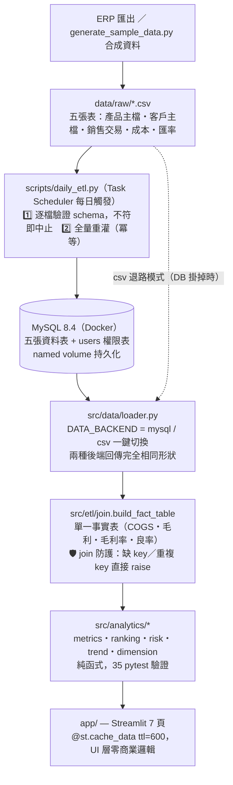
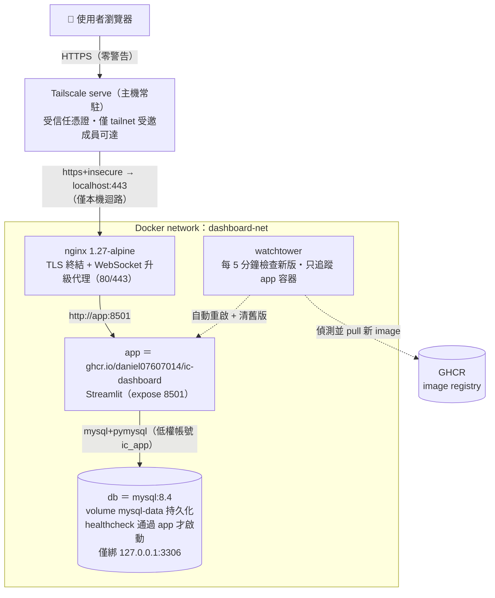
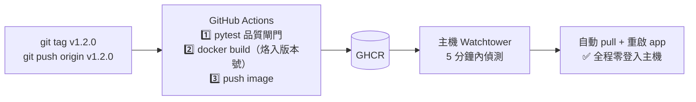

# IC 產品毛利率 Dashboard

Streamlit 打造的 IC 產品組合毛利率分析平台：從產品、產業、客戶、時間、成本結構五個切面
回答同一個問題——**「我們的毛利從哪裡來、正在往哪裡去、哪裡在漏」**。
附合成資料產生器，接真實 ERP 之前即可完整運作與 demo。

- 業務邏輯（`src/`）與 UI（`app/`）完全分離，35 個 pytest 單元測試守住每一條財務公式
- 雙資料後端：MySQL（正式）／CSV（開發與退路），一個環境變數切換
- 完整部署鏈：GitHub Actions CI → GHCR image → Watchtower 自動更新 → Nginx TLS → Tailscale 對外

---

## 功能總覽與實際效益

### 🏠 Overview · 總覽 — 30 秒掌握組合體質

| 功能 | 說明與實際效益 |
|---|---|
| KPI 卡（總營收／總毛利／平均毛利率／活躍 SKU） | 平均毛利率是**營收加權**（總毛利 ÷ 總營收），不是簡單平均——避免低營收高毛利的小產品灌水，數字可直接對財報 |
| 集中度 KPI（客戶/產品 HHI、Top 5 佔比） | 用 HHI 指數（>2500 高度集中）把「雞蛋放幾個籃子」量化成一個數字，董事會語言 |
| 月度營收 × 毛利率雙軸圖 | 一眼看出「營收成長但毛利率下滑」這類最危險的剪刀差 |
| 低毛利產品/客戶偵測（門檻可調） | 把「翻報表找問題」變成**例外管理**：低於門檻的料號/客戶自動浮上來 |
| 毛利率下滑偵測（近 3 月 vs 前 3 月） | 3 對 3 月視窗降噪，只抓真趨勢不抓單月雜訊——毛利崩之前先看到斜率 |
| NPI 產品體質 | 新產品的營收/毛利/良率一張表，ramp 不健康及早喊停 |

### 📊 產品分析 · Product — 哪些料號在賺錢

| 功能 | 說明與實際效益 |
|---|---|
| 毛利率分布（分面直方圖／箱型圖） | 直方圖用 Tukey IQR 圍籬**逐系列**剔除離群值看形狀；箱型圖刻意保留離群值——問題 SKU 就是要被看見 |
| 系列別彙總表 | 找出「量大毛利低扛規模」vs「量小毛利高扛獲利」的組合結構，失衡即警訊 |
| 製程節點彙總表 | 先進製程成本高就該賺更多——若 28nm 毛利率反而輸 130nm，代表定價沒把成本轉嫁出去 |
| SKU 毛利貢獻排行 | 金牛保產能、墊底料號逐顆檢討：漲價、cost-down 還是 EOL |

### 🏭 產業別分析 · Industry — 哪個市場的生意品質好

| 功能 | 說明與實際效益 |
|---|---|
| 產業別毛利率分布 + 彙總 | 車用/工業/消費/通訊的毛利結構對比，回答「該把業務資源押在哪個市場」 |
| Top 20 客戶表 | 依毛利貢獻排序——營收大戶不等於獲利大戶 |
| 系列 × 產業毛利率熱力圖 | 一張圖找出「高毛利甜蜜點」與「不該接的組合」；無交易的格子顯示空白而非 0%，不會誤判成慘賠 |

### ⭐ 重點客戶 · Key Accounts — 衣食父母配得上這個地位嗎

| 功能 | 說明與實際效益 |
|---|---|
| Pareto/ABC 曲線 | 累積營收曲線 + 80/95% 分級線，A 級客戶名單是**資料推導**的，不是感覺；caption 動態顯示實際貢獻比例 |
| 雙軌 A 級對照 | 資料推導的 Pareto A 級 vs 業務指定的主檔 A 級——兩者的重疊度本身就是資源配置的健檢 |
| 單一客戶 drill-down | 該客戶的月度營收毛利趨勢 + Top 10 採購料號：QBR（季度客戶檢討）直接開這頁 |

### 📈 趨勢分析 · Trend — 動能往上還是往下

| 功能 | 說明與實際效益 |
|---|---|
| 系列別／產業別毛利率趨勢線 | 每月營收加權毛利率，固定配色（同一系列在全站永遠同色），跨頁對照不用重新認色 |
| 毛利 MoM / YoY 成長柱 | YoY 是**日曆對齊**的（缺月不會錯位），跳月顯示空白而非假數字 |
| **毛利變化 PVM 瀑布圖** | 兩個月份之間的毛利變化拆成**價格／成本／數量／組合**四因子，四項加總恆等於毛利變化（有單元測試保證）。檢討會直接對到責任歸屬：價格→業務定價、成本→採購/製造、數量→產能與需求、組合→產品策略 |

### 💰 成本與體質 · Cost — 為什麼是這個毛利

| 功能 | 說明與實際效益 |
|---|---|
| 系列別單位成本組成堆疊圖 | 晶圓/封裝/測試/製費/權利金五項拆解（未含良率損耗，圖上有註明），cost-down 談判前先知道錢花在哪 |
| 良率 × 單位成本散布圖 | 紅線（90% 良率）以下自動標料號、右下象限（又貴又低良率）淡紅標記＝**優先改善族群**，會議上不用再吵先修誰 |
| 低良率清單 | <90% 的料號一張表，直接變成品質部門的工作清單 |

### ⚙️ 權限管理 · Admin（僅 admin 可見）

| 功能 | 說明與實際效益 |
|---|---|
| 使用者管理 UI（MySQL 模式） | 新增/停用/重設密碼全在 UI 完成，不用碰伺服器；停用**立即生效**（含已登入的 session） |
| CSV/YAML 退路模式 | DB 掛掉時切回 `DATA_BACKEND=csv`，帳號改由 `auth_config.yaml` 唯讀供應，dashboard 不斷線 |

### 🔬 數字可信度（簡報時的殺手鐧）

- **所有財務公式住在 `src/analytics/`，純函式、無 UI 依賴，35 個 pytest 直接驗算**——毛利率加權、ABC 邊界、PVM 恆等式、風險偵測全數有測試。
- **fact table 的 join 有防護**：成本表缺 key 或重複 key 會當場報錯，而不是靜默產生 NaN 高估毛利——「寧可炸，不要錯」。
- 清洗政策集中一處（`src/etl/clean.py`）：負量/負價視為退貨剔除、缺良率補 95%，規則可稽核。
- Schema 唯一定義處 `src/data/schema.py`：接真 ERP 時對齊欄位只改一個檔案。

---

## 合成資料設計 — demo 數據的擬真原理

`scripts/generate_sample_data.py --seed 42` 產生五張 CSV。**這不是均勻亂數**：
每個數字都由 IC 產業的真實因果結構推導，所以每一頁分析功能都有真實形狀可看，
而且固定 seed 完全可重現（測試與 demo 的數字永遠一致）。

### 成本：照半導體物理連動，不是擲骰子

```
單位成本 = (晶圓 + 封裝 + 測試 + 製費 + 權利金) ÷ 良率
```

| 成本項 | 生成邏輯 | 對應的產業現實 |
|---|---|---|
| 晶圓成本 | 依製程節點定價：130nm $0.30 → 28nm $1.90/die | 先進製程產能貴 |
| 封裝成本 | 依封裝型式（BGA $0.22 > QFN > SOP > DFN $0.04），再隨腳位數上升 | BGA 基板比 leadframe 貴、腳多線多 |
| 測試成本 | 隨腳位數線性增加 | 測試時間 ∝ 腳位數 |
| 學習曲線 | 量產每滿 3 個月成本 ×0.99 | 良率爬坡後的 cost-down |
| 良率生命週期 | 上市 <3 月：75–85%、3–12 月：85–93%、成熟期：93–98% | NPI 爬坡曲線 |
| 良率損耗 | 原始成本 ÷ 良率折進單位成本 | 80% 良率的 die 有效成本多 25% |

### 售價：從目標毛利反推，內建刻意的離群值

```
單價 = 單位成本 × (1 + 系列目標毛利 + 客戶分級調整 ± 雜訊 σ=5%)
```

- **系列目標毛利**反映產業慣例：RF 50%、Sensor 45%、PMIC 40%、MCU 30%、DriverIC 25%
  ——所以產品分析頁的系列毛利率結構有意義，不是巧合
- **客戶分級調整**：A 級 +5%、C 級 −5%（策略客戶拿較好的毛利組合）
- **8 顆刻意離群的料號**：4 顆 loss leader（毛利 −15%～5%）＋ 4 顆 super margin（60–80%）
  ——風險偵測、IQR 離群值剔除、SKU 排行的「墊底檢討」都有真實目標可抓

### 交易行為：80/20 集中度與季節性

- **客戶結構**：40 家分 A:B:C ＝ 5:15:20 家，接單機率 50%/35%/15%、
  單筆量級 5000/1500/400——自然長出 Pareto 曲線的 80/20 形狀，HHI 集中度有感
- **Q4 季節性**：10–12 月出貨量 ×1.25，趨勢頁看得到年底峰
- **產品生命週期**：EOL 料號 50% 機率當月無單、NPI 30%——drill-down 有稀疏感
- **幣別**：USD 55%／TWD 20%／EUR・CNY 各 10%／JPY 5%（金額已折算 USD 儲存），
  搭配匯率表（5 幣別 × 24 月，基準 ±3% 隨機游走）

### 規模與參數

預設 80 顆料號 × 40 家客戶 × 24 個月 → 約 8,000 筆交易、1,920 筆月成本。
`--products`、`--customers`、`--months`、`--seed` 皆可調，換 seed 即得一組全新但
結構相同的資料集。

> 簡報講法：「假資料的價值不在數字本身，在於**它把領域知識編進資料裡**——
> 先進製程該更貴、NPI 良率該爬坡、A 級客戶該量大——所以每個分析功能
> 在接真 ERP 之前就能被有意義地驗證。」

---

## 系統架構

### 資料流：CSV → MySQL → Python → 瀏覽器



**設計重點**：`src/` 不 import Streamlit——分析邏輯可以被 dashboard 用、被 notebook 用、
被排程報表用，測試不需要啟動 web server。金額一律以 USD 儲存，展示他幣在 UI 層轉換，
聚合永遠無歧義。

### 容器架構：一鍵起整組



所有容器 `restart: unless-stopped`，主機重開機後全組自動回復。

### CI/CD：上 tag 就是發版



---

## 資訊安全設計（縱深防禦）

| 層 | 機制 | 防的是什麼 |
|---|---|---|
| **網路曝露** | 不開防火牆、不綁公網 IP。對外唯一入口是 **Tailscale**（WireGuard mesh VPN）：管理端邀請制，未受邀的裝置**連掃描都掃不到這台機器** | 整個公網攻擊面（port scan、暴力嘗試、0-day 掃描） |
| **傳輸加密** | 兩層 TLS：外層 Tailscale 自動簽發/續期的受信任憑證（瀏覽器零警告）；內層 nginx self-signed 加密 Docker 網段流量 | 中間人攻擊、內網竊聽 |
| **身分認證** | 密碼以 **bcrypt（cost 12）** 雜湊儲存，登入後發放 **COOKIE_KEY 簽章的 JWT cookie**（7 天效期）。登入集中在 `app/main.py` 單點把關：未登入時 `st.navigation` 只露出登入頁，其他頁面路由根本不存在 | 密碼庫外洩後的離線破解、session 偽造、未授權存取 |
| **權限控制（RBAC）** | `viewer` / `admin` 兩級角色，每頁頂部 `require_role()` 檢查；Admin 頁對非 admin **連選單都不出現**（不是「點進去被擋」，是「看不見」） | 越權操作、水平提權 |
| **帳號生命週期** | Admin UI 停用帳號後：新登入立即失效；**已登入者的 cookie 在下一次頁面互動時強制登出並銷毀**（處理了 streamlit-authenticator「cookie 比帳號活得久」的已知缺口） | 離職/轉調人員的殘留存取 |
| **資料庫** | 所有 SQL 走 SQLAlchemy **參數化查詢**（零字串拼接）；MySQL 只綁 `127.0.0.1`，公網不可達；app 使用低權帳號 `ic_app`，root 密碼獨立 | SQL injection、資料庫直連攻擊 |
| **Secrets 管理** | `.env`、`auth_config.yaml`、`data/raw/*` 全部 gitignore（已驗證 **git 全歷史零 secrets**）；docker-compose 用 `${VAR:?}` 語法——缺密鑰直接拒絕啟動，不會靜默用弱預設 | 憑證進版控、弱密鑰上線 |
| **供應鏈** | image 只從 GHCR 拉取、且必經 CI 的 pytest 閘門才會被 build；Watchtower 只監控指定容器 | 未經測試的版本上線 |

**Tailscale 分享流程**：管理後台 → Users → Invite（免費方案可邀 3 人）→ 對方安裝
Tailscale 接受邀請 → 用同一網址存取。整條鏈不需要買網域、不需要開任何防火牆 port。

---

## 快速開始

### 本機開發（CSV 模式，最快路徑）

```bash
python -m venv ic_venv
ic_venv\Scripts\activate               # macOS/Linux: source ic_venv/bin/activate
pip install -r requirements.txt

# 產生合成資料（寫進 data/raw/）
python scripts/generate_sample_data.py --seed 42

# 建立第一個 admin 帳號（產生 config/auth_config.yaml）
python deploy/scripts/init_admin.py --username admin

# 手動建立 .env（本檔不進 git）：
#   COOKIE_KEY=<長隨機字串，python -c "import secrets; print(secrets.token_hex(32))">
#   DATA_BACKEND=csv

streamlit run app/main.py              # → http://localhost:8501
```

### MySQL 模式

```bash
docker compose up -d db                          # 只起資料庫
python scripts/init_db.py --migrate-users        # 建表 + CSV 灌入 + 搬使用者
# .env 加上：DATA_BACKEND=mysql、DB_PASSWORD=...、MYSQL_ROOT_PASSWORD=...
streamlit run app/main.py
```

### 正式部署（整組容器）

```bash
# 內層 self-signed 憑證（外層由 Tailscale 處理，瀏覽器不會看到這張）
openssl req -x509 -newkey rsa:2048 -nodes -days 365 \
    -keyout deploy/nginx/certs/privkey.pem \
    -out    deploy/nginx/certs/fullchain.pem -subj "/CN=localhost"

docker compose up -d --build                     # db + app + nginx + watchtower

# 對外發布（主機執行一次，常駐、重開機仍在）
tailscale serve --bg https+insecure://localhost:443
```

---

## 目錄結構

```
app/                Streamlit UI 層（只 render，零商業邏輯）
  main.py           st.navigation 入口，登入單點把關
  pages/            7 頁薄殼：Overview / Product / Industry / Trend / Cost / Admin / Key_Accounts
  components/views/ 頁面實際內容（改 UI 先找這裡）
  auth/             登入（authenticator.py）+ 角色（permissions.py）
src/                業務邏輯層（無 Streamlit 依賴，pytest 直接測）
  data/             schema 定義 + 雙後端 loader + users CRUD
  etl/              清洗（clean.py）+ join（join.py → fact table）
  analytics/        純函式：metrics / ranking / risk / trend / dimension
scripts/            合成資料產生器、init_db、daily_etl
deploy/             nginx 設定、憑證、輔助腳本
tests/              pytest（35 tests：公式驗算、join 防護、PVM 恆等式）
```

分層原則與開發約定詳見 `CLAUDE.md`。

## 常用指令

```bash
./ic_venv/Scripts/python.exe -m pytest tests/ -q        # 單元測試
python scripts/generate_sample_data.py --seed 42        # 重生合成資料
python scripts/daily_etl.py                             # 手動觸發每日 ETL
docker compose logs -f app                              # 看 app log
docker compose down                                     # 停掉整組（資料在 named volume，不會消失）
git tag v1.x.x && git push origin v1.x.x                # 發版（CI → GHCR → 自動部署）
```
